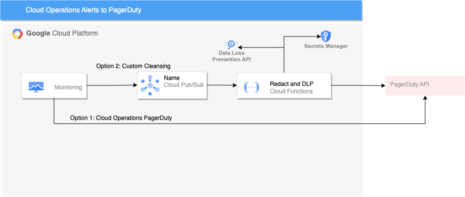

# Using Data Loss Prevention (DLP) to Pass Google Cloud Operations Alerts to PagerDuty
Data protection and security have become a top priority for businesses. Organizations of all sizes are striving to implement the best practices and tools to safeguard their sensitive data from unauthorized exposure. Google Cloud Operations Alerts, Data Loss Prevention, and PagerDuty are three such tools that help businesses securely monitor and respond to incidents in real-time. 

Google Cloud Operations Suite already has an existing integration with PagerDuty and the instructions for implementing "Option 1" below can be found in the [Google Documentation](https://cloud.google.com/monitoring/support/notification-options#pagerduty)

If you have a requirement to redact certain parts of your data or want to do a sanity check by passing it through DLP prior to passing the data outside of your Google Cloud account, this is where "Option 2" could come into play. In this example, we'll be using Google Cloud's Pub/Sub, Data Loss Prevention (DLP) and Cloud Functions services to pass Google Cloud Operations Alerts to PagerDuty in near real-time.



## Google Disclaimer
This is not an officially supported Google product

## Prerequisites
* A PagerDuty account ([trial](https://www.pagerduty.com/sign-up/) accounts are valid for 14 days)

## Project Creation and API Enablement
```
export PROJECT_NAME=pagerduty-alerts
export PAGERDUTY_SERVICE_ID=[ServiceID]
export BILLING_ACCOUNT=[Google Cloud Billing ID]
export PUBSUB_TOPIC=pager_duty_topic

printf 'Y' | gcloud projects create --name=$PROJECT_NAME --organization=$ORGANIZATION_ID
PROJECT_ID=$(gcloud projects list --filter=name:$PROJECT_NAME --format 'value(PROJECT_ID)')
PROJECT_NUMBER=$(gcloud projects list --filter=name:$PROJECT_NAME --format 'value(PROJECT_NUMBER)')
gcloud beta billing projects link $PROJECT_ID --billing-account=$BILLING_ACCOUNT

gcloud config set project $PROJECT_ID

printf 'y' |  gcloud services enable cloudfunctions.googleapis.com --project $PROJECT_ID
printf 'y' |  gcloud services enable cloudbuild.googleapis.com --project $PROJECT_ID
printf 'y' |  gcloud services enable pubsub.googleapis.com --project $PROJECT_ID
printf 'y' |  gcloud services enable dlp.googleapis.com --project $PROJECT_ID
printf 'y' |  gcloud services enable secretmanager.googleapis.com --project $PROJECT_ID
```

## Create PagerDuty Secret
The full SDK for Secret Manager can be found [here](https://cloud.google.com/sdk/gcloud/reference/scheduler), but at a minimum, this will store a secret you can use.
```
gcloud secrets create pagerduty_token \
--data-file=/tmp/pagerduty_token.txt
```

## Cloud Function and Monitoring Channel with Associated PubSub Topic
```
#Note: Sometimes you may get an error executing the below if you try this command within a few seconds of creating a new project. The error will state: "If the topic's project was recently created, you may need to wait a few minutes for the project's organization policy to be properly initialized, and then retry this operation."

gcloud pubsub topics create $PUBSUB_TOPIC

gcloud functions deploy pager_duty_function \
--runtime python310 \
--memory=128MB \
--trigger-topic $PUBSUB_TOPIC \
--ingress-settings internal-and-gclb \
--allow-unauthenticated \
--entry-point entry \
--set-env-vars PROJECT_ID=$PROJECT_ID,PAGERDUTY_SERVICE_ID=$PAGERDUTY_SERVICE_ID \
--source=./function

gcloud beta monitoring channels create \
--display-name="PagerDuty PubSub" \
--description="Pager Duty PubSub and Cleaning Functions" \
--type=pubsub \
--channel-labels=topic=projects/$PROJECT_NUMBER/topics/$PUBSUB_TOPIC \
--project=$PROJECT_ID

notification_channel=$(gcloud beta monitoring channels list --filter='displayName:"PagerDuty PubSub"' --format='value(name)')

gcloud pubsub topics add-iam-policy-binding \
projects/$PROJECT_NUMBER/topics/$PUBSUB_TOPIC --role=roles/pubsub.publisher \
--member=serviceAccount:service-$PROJECT_NUMBER@gcp-sa-monitoring-notification.iam.gserviceaccount.com
 
gcloud projects add-iam-policy-binding $PROJECT_ID \
--role=roles/dlp.user \
--member=serviceAccount:$PROJECT_ID@appspot.gserviceaccount.com

gcloud projects add-iam-policy-binding $PROJECT_ID \
--role=roles/secretmanager.secretAccessor \
--member=serviceAccount:$PROJECT_ID@appspot.gserviceaccount.com
```

## Create an Alerting Policy	
```
#Use this command to replace the project id in the example alerting policy
sed -i "s/PLACEHOLDER_PROJECT_ID/$PROJECT_ID/g" example_alert_policy.json 

#Create the alerting policy and attach it to the notification previously created
gcloud alpha monitoring policies create --policy-from-file="example_alert_policy.json" --notification-channels=$notification_channel
```

## Example Execution and Results
```
gcloud logging write --severity=CRITICAL --payload-type=json custom_web_app_log '{"message":{"type":"permissions_change","action":"admin_access_grant","email":"danreardon@gmail.com","role":"Web Application Admin"}}'
```
The alert surfaced in PagerDuty after the Cloud Function called the PagerDuty API.


| Description        | Screenshot          |
|:------------- |:-------------|
| The full JSON payload passed in through the Cloud Function via the PagerDuty the API.<ul type="square"><li>See the [Redacted] notice for the targeted field manually redacted</li><li>See the [EMAIL_ADDRESS] annotion for the field DLP identitifed and replaced with its respective INFOTYPE</li></ul>|  | 

## Additional Documentation
* https://medium.com/google-cloud/protect-sensitive-info-in-logs-using-google-cloud-4548211d4654
* https://cloud.google.com/logging/docs/alerting/log-based-alerts
